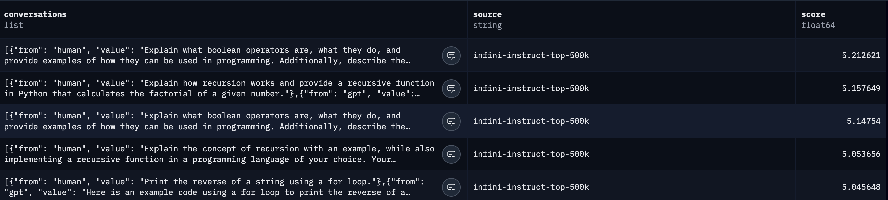
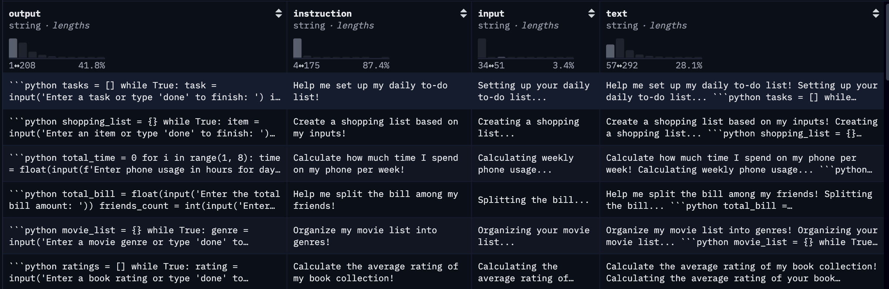
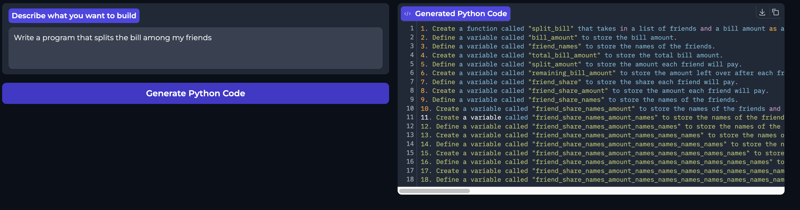
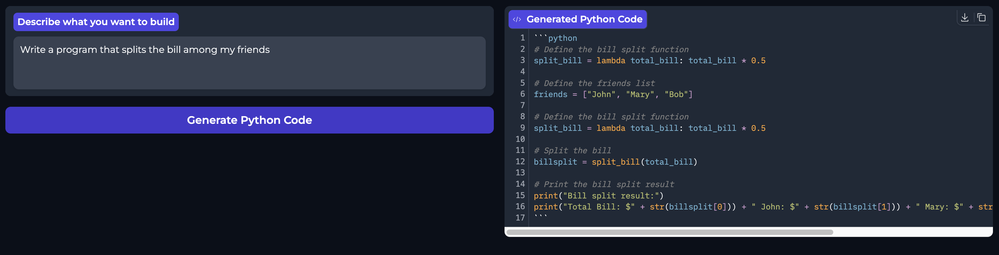

# Overview 
Finetome100K & flytech/python-codes-25k

We almost used every data point in the flytech dataset. The notebook for the first iteration was configured a little bit different since we downloaded the peft module to set lora params. We also trained on a quantsiezed version.

We used Unsloth and orginal LLM was LLama-3B instruct.

We did it in Kaggle for GPU support, we saved checkpoints in Huggingface in order to continue fintuning.

The gradio app we devloped can be found using the following link: https://huggingface.co/spaces/astegaras/iris

# Task 2 

The overall goal of our FineTuned model is to be as good as possible at generating python code for simple natural language stated questions, e.g. "Help me to make a todo list". 

The model uses meta-llama/Llama-3.2-3B as its base model and is fine-tuned on several datasets using the LoRA technique, which adapts the model by training only small low-rank weight matrices instead of updating all parameters, making fine-tuning faster, cheaper, and more efficient.

## Improve model perfomance using data centric approach 
In the first iterations of finetuning the LLM we used a dataset called mlabonne/FineTome-100k. This dataset can be found on Huggingface. The datasets consists of 100k rows of conversations between a human (asking for about a coding subject) and an agent answering the coding problem. Here a sample of some lines of the FineTome dataset: 

We used this dataset flytech/python-codes-25k to improve our fintuning. This dataset consists of 25k rows and have the following fields: 

instruction: The instructional task to be performed / User input
input: Very short, introductive part of AI response or empty
output: Python code that accomplishes the task
text: All fields combined together

Here is a sample of some lines of the dataset: 

Here is the link to the finetuned model using the FineTome dataset: https://huggingface.co/spaces/astegaras/iris_before_code 

Here is the link to the finetuned model using the python-codes-25k dataset: https://huggingface.co/spaces/astegaras/iris

### Difference of Model answers for the same request

**FineTome Finetune model**

**Python-codes-25k Finetune model**

Here, you can clearly see that the second model is much better at answering the user's request. The first model gives more of an instruction-like explanation on how to build a Python program that performs the task. The second model, however, provides executable Python code that directly solves the problem, and it is very straightforward.

The reason the second model performs so much better on code-related questions is that the dataset is better suited for this purpose. The python-codes-25k dataset is more appropriate because it is more direct in its structure: it has a dedicated field containing only the Python code that completes the instructed task. In contrast, the Fintome dataset includes a lot of additional text from the agent that is not code. This can confuse the LLM during finetuning, as it might not know whether it should respond with plain text or with code.
